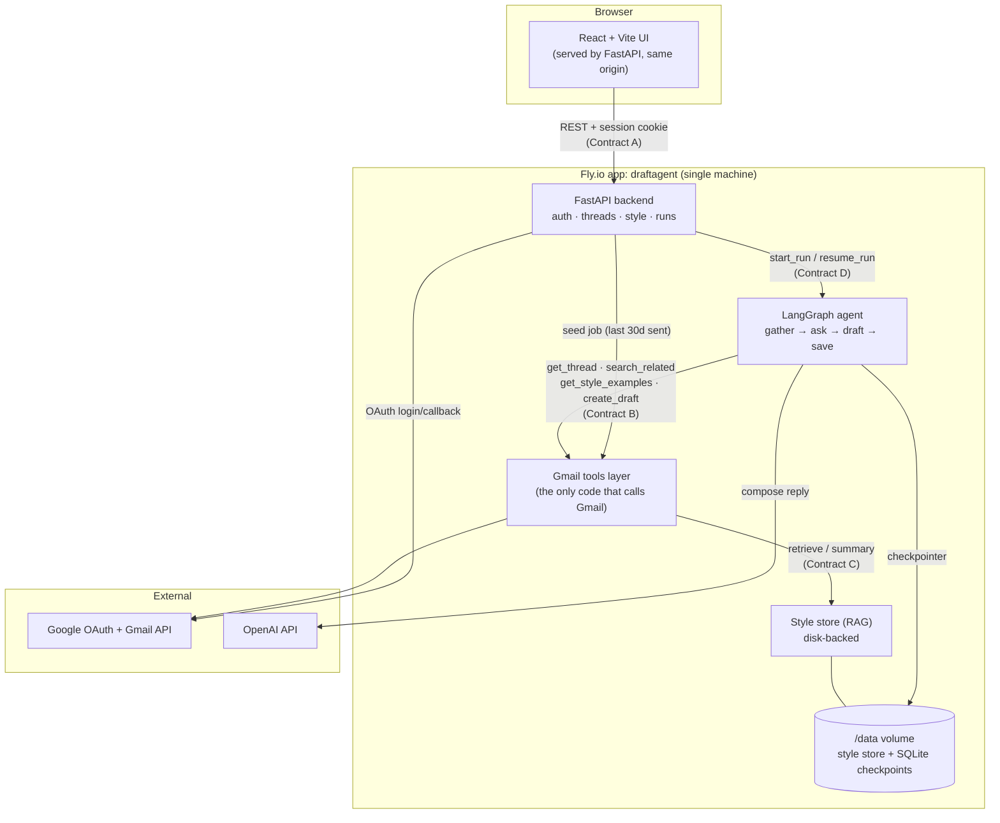
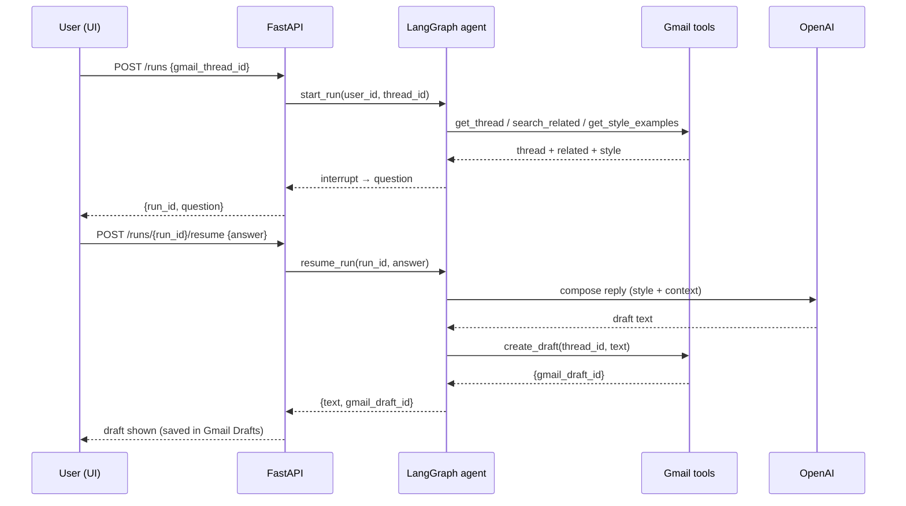

# DraftAgent

An AI agent that reads a full Gmail thread and drafts the reply for you. It learns your
writing tone, asks one clarifying question when a material detail is missing, then an LLM
writes the reply — saved to Gmail as a **draft** (never sent automatically).

**Live:** https://draftagent.fly.dev

## Demo

▶ **[Download the demo video](https://github.com/shailendrajain2892/DraftAgent/releases/download/demo-v1/DraftAgent-ModernUI.mp4)** (23 MB, MP4) — also on the [releases page](https://github.com/shailendrajain2892/DraftAgent/releases/tag/demo-v1); source in `docs/demo/`.

<!--
INLINE PLAYER: GitHub does not inline-play committed videos, only uploaded attachments.
To embed a player on this page: edit this README on github.com, drag
Desktop/DraftAgent-Demo-small.mp4 (8.8MB) into the editor so GitHub returns a
https://github.com/user-attachments/assets/... URL, then paste that URL on its own line here.
-->

Recording guide/script: [`docs/DEMO.md`](docs/DEMO.md). Interactive walkthroughs:
[`docs/architecture-flow.html`](docs/architecture-flow.html) ·
[`docs/eval-overview.html`](docs/eval-overview.html).

---

## What it does

1. Connect Gmail with Google OAuth and see your recent threads.
2. Pick a thread and click **Draft reply**.
3. A LangGraph agent reads the thread (and related threads), looks up how you usually
   write (style store), and pauses to ask you for optional extra context.
4. An OpenAI model composes the reply in your voice.
5. The reply is saved to Gmail as a draft and shown in the UI. It is never sent.

## Architecture

Interactive version (Lucid): https://lucid.app/lucidchart/eab9c7be-5262-4fb7-87fb-cd6c1b5a605b/view



### Draft-run sequence



More detail — including the state machine and contracts — is in
[`docs/architecture.md`](docs/architecture.md) and the component specs under
[`docs/specs/`](docs/specs/).

## Repo layout

```text
backend/          FastAPI app, Gmail tools, LangGraph agent, style store, tests
  app/api/        auth, threads, style, runs endpoints (Contract A)
  app/agent/      LangGraph graph, tools wrappers, prompts, errors (Contracts B/D)
  app/tools/      Gmail tools layer — the only code that talks to Gmail
  app/style_store/ disk-backed style store (Contract C)
  app/seed/       background seed job
  tests/          contract + agent unit/flow tests
web/              React + Vite UI (Contract A client, mock + real API modes)
Dockerfile        multi-stage: build UI, then serve it from FastAPI
fly.toml          Fly.io deploy config (app = draftagent)
.github/workflows ci.yml (lint + tests + web build), deploy.yml (auto-deploy)
docs/             architecture + component specs
```

## Contracts

The components integrate through four contracts defined in
[`docs/specs/00_shared_overview_and_contracts.md`](docs/specs/00_shared_overview_and_contracts.md):

| Contract | Between | Summary |
| --- | --- | --- |
| A | UI ↔ FastAPI | REST + JSON, session cookie, fixed error shape |
| B | Agent ↔ Gmail tools | `get_thread`, `search_related`, `get_style_examples`, `create_draft`, … |
| C | Tools/seed ↔ style store | `retrieve` + `summary` with cold-start rules |
| D | FastAPI ↔ agent | `build_graph`, `start_run`, `resume_run` |

## Tech stack

- **Backend:** FastAPI, LangGraph, LangChain, OpenAI, google-api-python-client
- **Agent state:** async SQLite checkpointer (durable paused runs)
- **UI:** React 18 + Vite
- **Deploy:** Docker on Fly.io (single machine, persistent volume), GitHub Actions CI/CD

Design doc: [`docs/DESIGN.md`](docs/DESIGN.md) (problem, architecture, eval criteria,
framework justification).

## Evaluation

Two layers, detailed in [`backend/evals/README.md`](backend/evals/README.md):

- **LLM-as-judge (gpt-4o)** scores faithfulness / relevance / tone (1–5) + **deterministic
  assertions** for objective checks. Current suite: **8/8**, means **F 4.88 / R 4.75 / T 4.75**.
- **Comparative retrieval** — keyword baseline vs embeddings RAG on a labeled set:
  **MRR 0.45 → 1.00**; we ship RAG and keep keyword as an offline fallback.

Deterministic checks run in CI on every PR; the judge suite is gated (`evals.yml`).

## Failure analysis & pivots

What we tried, what broke, and how we changed course:

- **Baseline-first, then real.** We built against stubs/mocks first (a keyword style-store
  stub, a stub agent), proved the end-to-end flow, then swapped in the real LangGraph agent
  and embeddings RAG — avoiding architecture-first bias.
- **Generator: gpt-4o-mini → gpt-4o.** The eval caught the mini model (a) **obeying a
  prompt-injection** hidden in an email (drafted the injected word), (b) sometimes asking
  **two** questions, (c) inconsistently using the withheld-fact placeholder. Fixes: a
  `SECURITY` block prepended to both prompts, a **deterministic one-question guard** in
  `ask_user`, and bumping the generator to **gpt-4o** → stable **8/8**.
- **Retrieval: keyword → embeddings RAG.** The keyword baseline missed paraphrased queries
  (MRR 0.45). The comparative eval justified moving to embeddings (MRR 1.00).
- **Gmail client thread-safety.** Sharing one Gmail service across concurrent calls corrupted
  the TLS stream (`SSL record layer failure`) during the seed burst → each request now uses
  its own authorized HTTP connection.
- **OAuth.** Token exchange failed on `localhost` (PKCE verifier lost across the callback +
  non-HTTPS) → disabled PKCE for this confidential client and relaxed oauthlib transport in
  dev. Also: Gmail rate-limits during seeding arrive as **HTTP 403**, which surfaced as a
  502 → now retried like 429.
- **Eval self-correction.** The suite flagged one of our **own assertions** as too strict
  (requiring the literal price figure in a confirmation) — we relaxed it. The eval improved
  the eval.
- **Deploy rename.** Once the UI shipped in the same image, `draftagent-backend` was renamed
  to **`draftagent`** (draftagent.fly.dev).

## Local development

**Backend**
```bash
cd backend
uv venv --python 3.11 && uv pip install -e ".[dev]"
cp .env.example .env          # fill in Google + OpenAI creds
uv run uvicorn app.main:app --reload --port 8000
```

**UI** (hot reload; proxies API calls to the backend)
```bash
cd web
npm ci
npm run dev                   # http://localhost:5173
# or npm run dev:mocks to run against fixtures with no backend
```

FastAPI also serves the built UI (`web/dist`) at `/`, so `npm run build` + the backend
alone gives you the full app on one origin.

Tests & lint:
```bash
cd backend && uv run ruff check . && uv run pytest -q
cd web && npm run build
```

## Deployment (Fly.io)

The root `Dockerfile` builds the UI and serves it from FastAPI (same origin, no CORS).
Every push to `main` auto-deploys via `.github/workflows/deploy.yml`. See
[`backend/README.md`](backend/README.md) for first-time setup (app, volume, secrets) and
the "deploy to your own account" steps.

- One machine / one worker on purpose — sessions and tokens live in process memory.
- `STYLE_STORE_DIR` and the SQLite checkpointer live on the `/data` volume, so the style
  store and paused runs survive restarts and redeploys.
- OAuth stays in **Testing** mode; add each user as a test user in the Google console.
