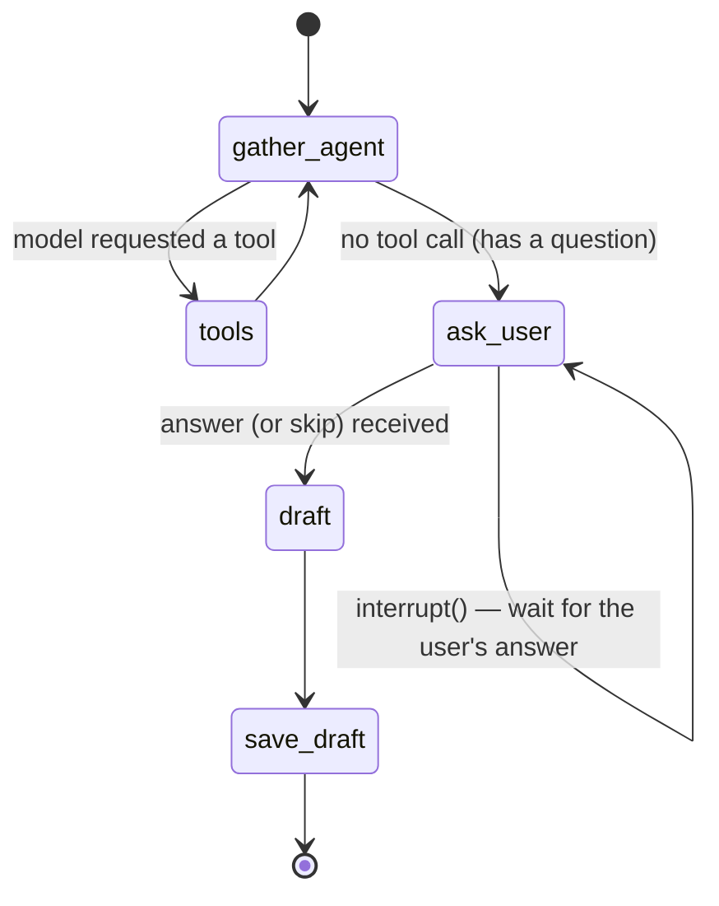
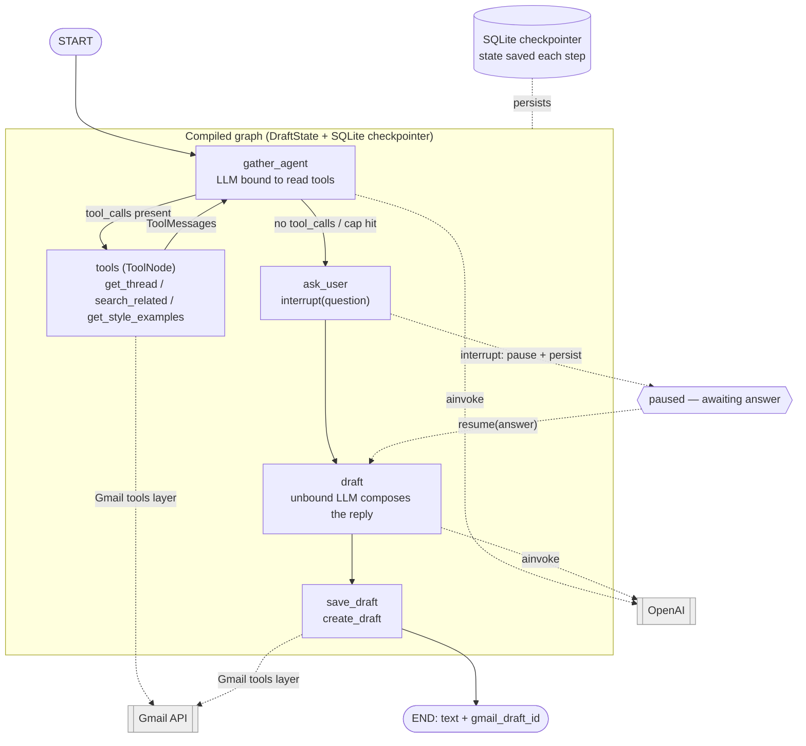
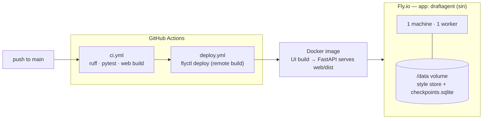

# DraftAgent — architecture

This document describes the system as built. The authoritative contracts live in
[`specs/00_shared_overview_and_contracts.md`](specs/00_shared_overview_and_contracts.md);
per-component detail is in `specs/01`–`04`.

Interactive architecture diagram (Lucid, icon-based):
https://lucid.app/lucidchart/eab9c7be-5262-4fb7-87fb-cd6c1b5a605b/view

## Components

| Component | Where | Responsibility |
| --- | --- | --- |
| Web UI | `web/` | React + Vite client of Contract A. Served by FastAPI in prod (same origin). |
| FastAPI backend | `backend/app/api`, `main.py` | OAuth + session, inbox, style status, run endpoints, error mapping. |
| Gmail tools | `backend/app/tools`, `backend/app/gmail` | The only code that calls Gmail. Enforces limits, retries, token refresh, per-user concurrency. |
| LangGraph agent | `backend/app/agent` | Reads context, asks one question, drafts with OpenAI, saves the draft. |
| Style store | `backend/app/style_store` | Disk-backed RAG of the user's past replies (Contract C). |
| Seed job | `backend/app/seed` | On first connect, indexes the last 30 days of sent replies. |

## Agent graph (LangGraph)

- **gather_agent** — bound to the read tools; loops with **tools** until it has enough
  context, capped by `MAX_AGENT_STEPS`.
- **ask_user** — always asks exactly one question via `interrupt()`; the run pauses here
  and the checkpointer persists state.
- **draft** — the unbound LLM composes the reply (never calls tools).
- **save_draft** — calls `create_draft`; auth/quota errors escape as 401/429, others → 502.

`run_id = "{user_id}:{gmail_thread_id}:{nonce}"` and is also LangGraph's `thread_id`.

### Graph detail — nodes, tools, LLM, checkpointer

State (`DraftState`): `messages`, `gmail_thread_id`, `user_context` (the answer; `None` =
skipped), `draft`, `gmail_draft_id`, `gather_steps`. Tool wrappers inject the trusted
`user_id`/`thread_id` from run config + state, so the model never supplies identity.
`start_run` drives the graph to the `interrupt`; `resume_run` supplies the answer and runs
to `END`.

## Request flow (Contract D)

`POST /runs` → `start_run` runs the graph to the interrupt and returns the question.
`POST /runs/{run_id}/resume` → `resume_run` supplies the answer, runs to completion, and
returns `{text, gmail_draft_id}`. A `run_id` that does not start with the caller's
`user_id` is rejected as `NOT_FOUND`.

## Error mapping (Contract A)

Domain errors in `backend/app/errors.py` carry a Contract A code + HTTP status. The agent
error names alias these same classes, so a real Gmail failure maps consistently:

| Error | HTTP | Code |
| --- | --- | --- |
| `AuthExpiredError` | 401 | `AUTH_EXPIRED` |
| `NotFound` | 404 | `NOT_FOUND` |
| `RunStateConflict` | 409 | `RUN_STATE_CONFLICT` |
| `GmailRateLimited` | 429 | `GMAIL_RATE_LIMITED` |
| `UpstreamError` (+ `SaveDraftError`, `DraftGenerationError`) | 502 | `UPSTREAM_ERROR` |

## Deployment topology

- Single machine / single worker on purpose — sessions and Google tokens live in process
  memory (lost on restart; users re-auth). No database.
- The `/data` volume persists the style store and the SQLite checkpointer across restarts
  and redeploys, so paused runs survive.
- Secrets (Google, OpenAI, `SESSION_SECRET`, `OAUTH_REDIRECT_URI`) are set via
  `fly secrets`, never committed. `FLY_API_TOKEN` (a Fly deploy token) is a GitHub secret.

## Notable design decisions

- **Gmail only through the tools layer** — the agent/LLM never call Gmail directly; limits
  (10 messages/thread, 2000 chars/body, 5 related) live in code, not the prompt.
- **Prompt-injection aware** — thread and related-thread content are treated as untrusted
  data; the model is told to ignore instructions inside them.
- **Same-origin UI** — FastAPI serves the built UI, so the `draftagent_session` cookie
  needs no CORS and Google tokens never reach the browser.
